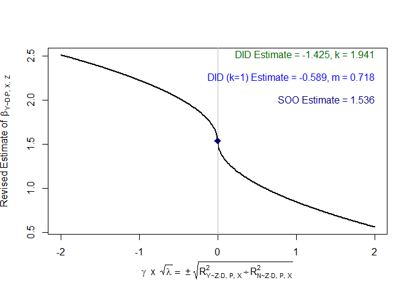

# ripp: R ImPerfect Placebos

<!-- badges: start -->
<!-- badges: end -->

Initial R package for making causal progress with imperfect placebos.
See Rohde and Hazlett (20XX) for details.

## Installation

You can install the development version of ripp from
[GitHub](https://github.com/) with:

``` r
# install.packages("devtools")
devtools::install_github("Adam-Rohde/ripp")
```

## Example

Here is a simple simulated example of how to use a placebo outcome `N`
to inform partial identification of the effect of `D` on `Y`. We start
by simulating some data. `Z` is an unobserved confounder. Then we fit
`lm(Y ~ D)` and `lm(N ~ D)`. Next, we call the `ripp` function, followed
by `ripp_summary`, `ripp_contour_plot`, and `ripp_line_plot`. We call
`ripp_line_plot` under the assumption that `beta.nd.pxz=0` as well as
under the assumption that `beta.nd.pxz=2`, which is the true value in
the simulation.

``` r
library(ripp)

data(lalonde,package = "qte")

plm = placeboLM(
  data = "lalonde.psid",
  placebo_data = NULL,
  outcome = "re78",
  treatment = "treat",
  placebo_outcome = "re74",
  placebo_treatment = "",
  DP = "",
  PY = "",
  observed_covariates = c("age", "education", "black", "hispanic", "married", "nodegree"),
  partialIDparam_minmax = list(k = c(-2,2), coef_P_D_given_XZ = c(-15000,15000)))
#> Placebo assumed to have no direct relationship with either treatment or outcome.


placeboLM_table(plm,n_boot = 100,ptiles = c(0,0.25,0.5,0.75,1))
#>        k coef_P_D_given_XZ   Estimate Std. Error  95% CI Low 95% CI High
#>  [1,] -2            -15000  11467.475  1962.9724   7953.8158   15652.360
#>  [2,] -2             -7500  -6273.733  2108.8508 -10760.5008   -2808.763
#>  [3,] -2                 0 -24014.941  2237.0234 -28374.8267  -20218.472
#>  [4,] -2              7500 -41756.149  2158.2868 -45734.4397  -38117.493
#>  [5,] -2             15000 -59497.357  2546.5583 -64847.0976  -55449.858
#>  [6,] -1            -15000   2769.682  1360.0104    447.9131    5492.592
#>  [7,] -1             -7500  -6100.922  1481.6013  -8671.5797   -3100.464
#>  [8,] -1                 0 -14971.526  1561.1535 -17681.2269  -12092.832
#>  [9,] -1              7500 -23842.130  1342.7122 -26320.1572  -21590.490
#> [10,] -1             15000 -32712.733  1588.3933 -35619.2992  -29587.637
#> [11,]  0            -15000  -5928.110   762.4172  -7264.7553   -4303.656
#> [12,]  0             -7500  -5928.110   823.6222  -7357.5044   -4297.531
#> [13,]  0                 0  -5928.110   802.4954  -7531.5751   -4439.232
#> [14,]  0              7500  -5928.110   761.7657  -7443.8268   -4298.230
#> [15,]  0             15000  -5928.110   858.7215  -7546.4682   -4307.815
#> [16,]  1            -15000 -14625.902  1001.2034 -16702.6746  -12898.971
#> [17,]  1             -7500  -5755.298   757.3037  -7371.5274   -4252.719
#> [18,]  1                 0   3115.306   797.1548   1625.3067    4501.299
#> [19,]  1              7500  11985.909   839.9441  10105.5055   13222.873
#> [20,]  1             15000  20856.513  1164.8824  18930.0381   22943.743
#> [21,]  2            -15000 -23323.695  1565.9349 -26561.8065  -20350.946
#> [22,]  2             -7500  -5582.487  1360.2701  -8296.7227   -3146.614
#> [23,]  2                 0  12158.721  1584.7793   9696.9933   15536.940
#> [24,]  2              7500  29899.929  1748.1809  26509.2358   32678.795
#> [25,]  2             15000  47641.137  2039.4814  43976.9423   51767.513

placeboLM_contour_plot(plm)
```


``` r

n = 1000
Z = stats::rnorm(n)
D = Z + stats::rnorm(n)
Y = D + Z + stats::rnorm(n)
N = 2*D + 2*Z + stats::rnorm(n)

m_Y_DPX = lm(Y ~ D)
m_N_DPX = lm(N ~ D)

ripper = ripp(type="placebo outcome",lm.y.dpx = m_Y_DPX,lm.n.dpx = m_N_DPX,treatment = "D")

ripp_summary(ripper)
```

|             |   SOO | Perfect Placebo DID | Perfect Placebo DID lambda=1 | RV lambda, q=1 | RV beta, q=1 |
|:------------|------:|--------------------:|-----------------------------:|---------------:|-------------:|
| beta.yd.pxz | 1.536 |              -1.425 |                       -0.589 |          0.523 |        0.821 |

``` r
ripp_contour_plot(ripper)
```


``` r
ripp_line_plot(ripper,beta.nd.pxz=0)
```


``` r
ripp_line_plot(ripper,beta.nd.pxz=2)
```


