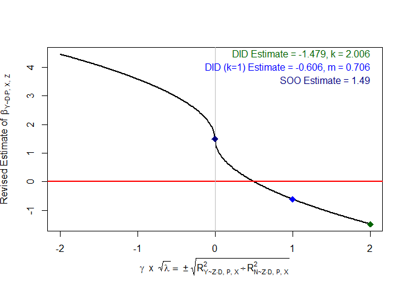
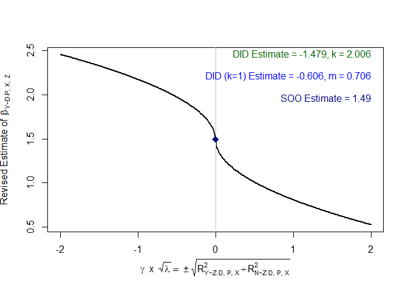

# ripp: R ImPerfect Placebos

<!-- badges: start -->
<!-- badges: end -->

Initial R package for making causal progress with imperfect placebos.
See Rohde and Hazlett (20XX) for details.

## Installation

You can install the development version of ripp from
[GitHub](https://github.com/) with:

``` r
# install.packages("devtools")
devtools::install_github("Adam-Rohde/ripp")
```

## Example

Here is a simple simulated example of how to use a placebo outcome `N`
to inform partial identification of the effect of `D` on `Y`. We start
by simulating some data. `Z` is an unobserved confounder. Then we fit
`lm(Y ~ D)` and `lm(N ~ D)`. Next, we call the `ripp` function, followed
by `ripp_summary`, `ripp_contour_plot`, and `ripp_line_plot`. We call
`ripp_line_plot` under the assumption that `beta.nd.pxz=0` as well as
under the assumption that `beta.nd.pxz=2`, which is the true value in
the simulation.

``` r
library(ripp)

n = 1000
Z = stats::rnorm(n)
D = Z + stats::rnorm(n)
Y = D + Z + stats::rnorm(n)
N = 2*D + 2*Z + stats::rnorm(n)

m_Y_DPX = lm(Y ~ D)
m_N_DPX = lm(N ~ D)

ripper = ripp(type="placebo outcome",lm.y.dpx = m_Y_DPX,lm.n.dpx = m_N_DPX,treatment = "D")

ripp_summary(ripper)
```

|             |  SOO | Perfect Placebo DID | Perfect Placebo DID lambda=1 | RV lambda, q=1 | RV beta, q=1 |
|:------------|-----:|--------------------:|-----------------------------:|---------------:|-------------:|
| beta.yd.pxz | 1.49 |              -1.479 |                       -0.606 |          0.505 |        0.859 |

``` r
ripp_contour_plot(ripper)
```


``` r
ripp_line_plot(ripper,beta.nd.pxz=0)
```



``` r
ripp_line_plot(ripper,beta.nd.pxz=2)
```


