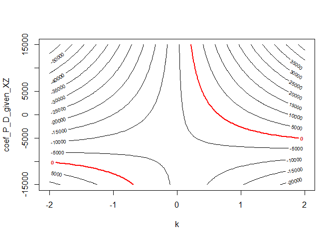

# ripp: R ImPerfect Placebos

<!-- badges: start -->
<!-- badges: end -->

Initial R package for making causal progress with imperfect placebos.
See Rohde and Hazlett (20XX) for details.

## Installation

You can install the development version of ripp from
[GitHub](https://github.com/) with:

``` r
# install.packages("devtools")
devtools::install_github("Adam-Rohde/ripp")
```

## Example

Here is a simple simulated example of how to use a placebo outcome `N`
to inform partial identification of the effect of `D` on `Y`. We start
by simulating some data. `Z` is an unobserved confounder. Then we fit
`lm(Y ~ D)` and `lm(N ~ D)`. Next, we call the `ripp` function, followed
by `ripp_summary`, `ripp_contour_plot`, and `ripp_line_plot`. We call
`ripp_line_plot` under the assumption that `beta.nd.pxz=0` as well as
under the assumption that `beta.nd.pxz=2`, which is the true value in
the simulation.

``` r
library(ripp)

data(lalonde,package = "qte")

plm = placeboLM(
  data = "lalonde.psid",
  placebo_data = NULL,
  outcome = "re78",
  treatment = "treat",
  placebo_outcome = "re74",
  placebo_treatment = "",
  DP = "",
  PY = "",
  observed_covariates = c("age", "education", "black", "hispanic", "married", "nodegree"),
  partialIDparam_minmax = list(k = c(-2,2), coef_P_D_given_XZ = c(-15000,15000)))
#> Placebo assumed to have no direct relationship with either treatment or outcome.


placeboLM_table(plm,n_boot = 100,ptiles = c(0,0.25,0.5,0.75,1))
#>        k coef_P_D_given_XZ   Estimate Std. Error   95% CI Low 95% CI High
#>  [1,] -2            -15000  11467.475  2045.5724   7799.48706   16151.464
#>  [2,] -2             -7500  -6273.733  2218.7855 -10698.96682   -1783.791
#>  [3,] -2                 0 -24014.941  2339.0498 -27436.80684  -19334.524
#>  [4,] -2              7500 -41756.149  2272.5012 -46271.93185  -37129.949
#>  [5,] -2             15000 -59497.357  2892.2902 -64934.33347  -53847.960
#>  [6,] -1            -15000   2769.682  1472.1302    -28.90502    5456.929
#>  [7,] -1             -7500  -6100.922  1264.2440  -8526.03904   -3720.718
#>  [8,] -1                 0 -14971.526  1402.9502 -18060.91661  -12574.951
#>  [9,] -1              7500 -23842.130  1512.3566 -26341.65590  -20729.126
#> [10,] -1             15000 -32712.733  1399.8434 -35601.93299  -29970.737
#> [11,]  0            -15000  -5928.110   758.6315  -7519.71649   -4596.607
#> [12,]  0             -7500  -5928.110   902.1463  -7840.18465   -4416.063
#> [13,]  0                 0  -5928.110   856.0683  -7500.04497   -4558.814
#> [14,]  0              7500  -5928.110   834.1274  -7453.55011   -4209.249
#> [15,]  0             15000  -5928.110   821.1818  -7515.36199   -4365.955
#> [16,]  1            -15000 -14625.902   850.0836 -16225.85341  -13235.137
#> [17,]  1             -7500  -5755.298   897.5163  -7458.07933   -4088.527
#> [18,]  1                 0   3115.306   814.6809   1737.14887    4641.368
#> [19,]  1              7500  11985.909  1086.3768  10068.90124   14102.529
#> [20,]  1             15000  20856.513  1186.2607  18522.82573   23010.983
#> [21,]  2            -15000 -23323.695  1490.2135 -26040.86423  -20108.855
#> [22,]  2             -7500  -5582.487  1353.5637  -8475.28280   -3076.768
#> [23,]  2                 0  12158.721  1434.0529   9453.24409   14800.205
#> [24,]  2              7500  29899.929  1655.6861  27086.13233   32970.541
#> [25,]  2             15000  47641.137  2173.8161  43819.06614   51941.875

placeboLM_contour_plot(plm)
```


