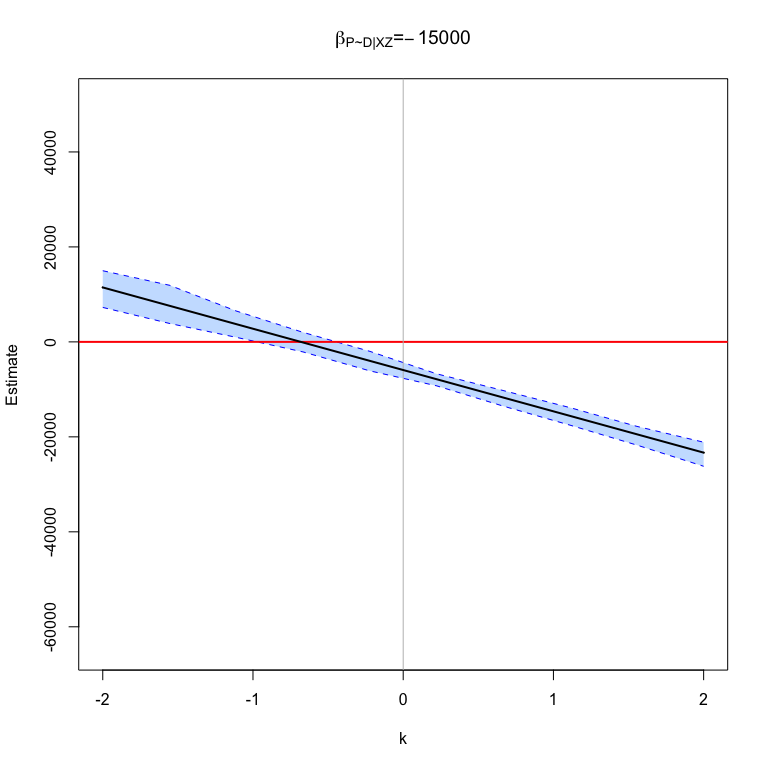

# PlaceboLM: Causal Progress with Imperfect Placebos

<!-- badges: start -->
<!-- badges: end -->

Initial R package for making causal progress with imperfect placebos.
See Rohde and Hazlett (20XX) for details.

## Installation

You can install the development version of ‘PlaceboLM’ from
[GitHub](https://github.com/) with:

``` r
# install.packages("devtools")
devtools::install_github("Adam-Rohde/PlaceboLM")
```

## LaLonde (1986) Example

``` r
library(PlaceboLM)

data(lalonde,package = "qte")

plm = placeboLM(
  data = "lalonde.psid",
  placebo_data = NULL,
  outcome = "re78",
  treatment = "treat",
  placebo_outcome = "re74",
  placebo_treatment = "",
  DP = "",
  PY = "",
  observed_covariates = c("age", "education", "black", "hispanic", "married", "nodegree"),
  partialIDparam_minmax = list(k = c(-2,2), coef_P_D_given_XZ = c(-15000,15000))
  )
#> Placebo assumed to have no direct relationship with either treatment or outcome.
#> 
#> Placebo Type: Single Placebo, No Direct Relationships, Placebo Outcome
#> 
#> Regression 1 : lm(re78~treat + age + education + black + hispanic + married + nodegree , data = plm$dta)
#> 
#> Regression 2 : lm(re74~treat + age + education + black + hispanic + married + nodegree , data = plm$dta)
#> 

set.seed(0)
placeboLM_table(plm,
                n_boot = 1000,
                ptiles = c(0.25,0.5,0.75),
                alpha = 0.05)
#>                           k       coef_P_D_given_XZ Estimate  Std. Error
#> No Unobserved Confounding 0       0                 -5928.11  822.574   
#> DID (m=1)                 0.84549 0                 1718.007  852.977   
#> Perfect Placebo, k=1      1       0                 3115.306  882.42    
#> Grid                      -1      -7500             -6100.922 1375.321  
#> Grid                      -1      0                 -14971.53 1379.987  
#> Grid                      -1      7500              -23842.13 1484.068  
#> Grid                      0       -7500             -5928.11  809.399   
#> Grid                      0       0                 -5928.11  842.29    
#> Grid                      0       7500              -5928.11  832.391   
#> Grid                      1       -7500             -5755.298 871.062   
#> Grid                      1       0                 3115.306  926.639   
#> Grid                      1       7500              11985.91  984.866   
#>                           CI Low    CI High  
#> No Unobserved Confounding -7563.277 -4337.092
#> DID (m=1)                 27.352    3393.965 
#> Perfect Placebo, k=1      1337.398  4783.298 
#> Grid                      -8843.014 -3539.267
#> Grid                      -17615.87 -12160.46
#> Grid                      -26566.69 -20663   
#> Grid                      -7473.883 -4304.647
#> Grid                      -7549.065 -4215.563
#> Grid                      -7523.876 -4262.117
#> Grid                      -7441.707 -4051.861
#> Grid                      1389.419  4907.9   
#> Grid                      10176.39  13963.14

placeboLM_contour_plot(plm,
                       gran= 100)
```


``` r
placeboLM_line_plot(plm,
                    bootstrap=TRUE,
                    n_boot=1000,
                    ptiles = c(0.5),
                    focus_param = "k",
                    ptile_param = "coef_P_D_given_XZ",
                    gran= 10,
                    alpha = 0.05)
```


