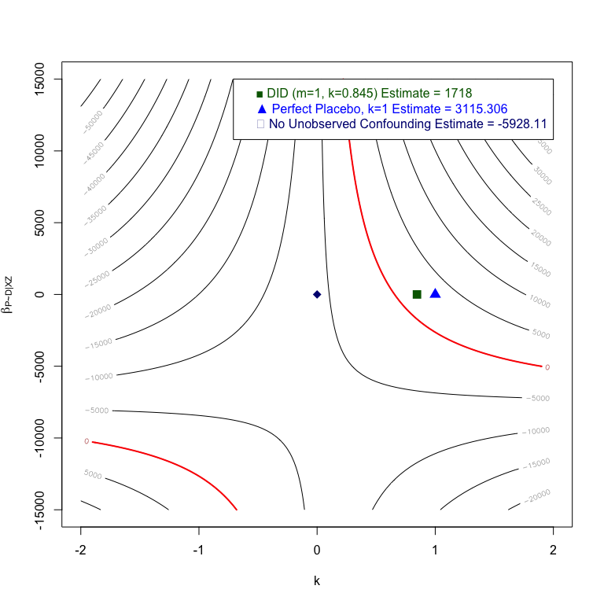
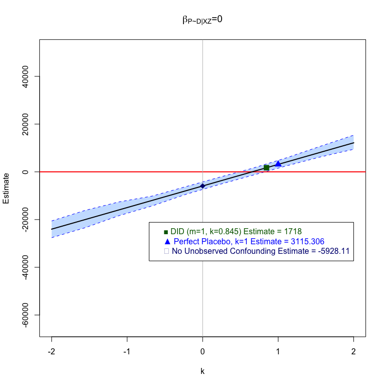
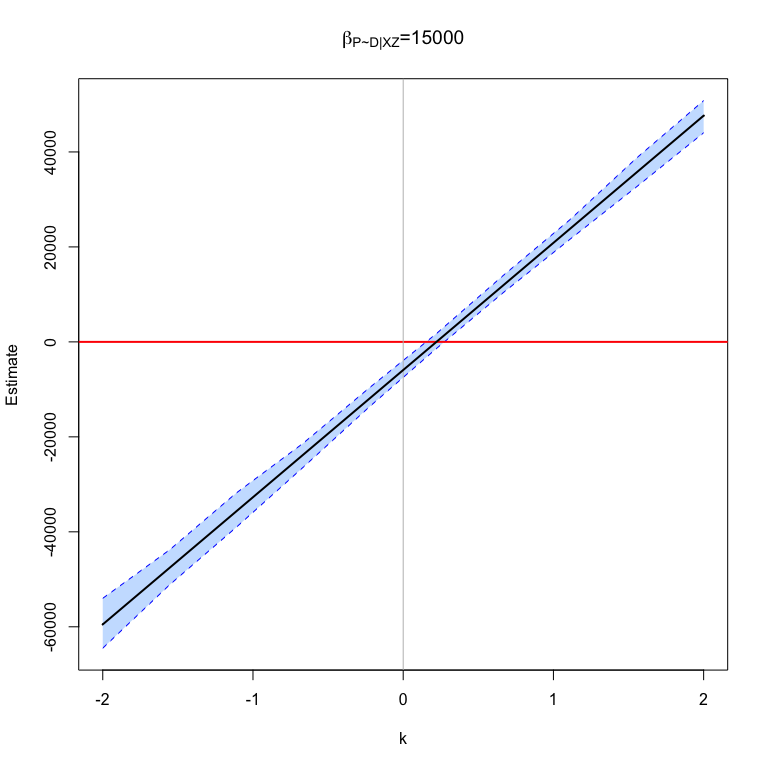

# ripp: R ImPerfect Placebos

<!-- badges: start -->
<!-- badges: end -->

Initial R package for making causal progress with imperfect placebos.
See Rohde and Hazlett (20XX) for details.

## Installation

You can install the development version of ripp from
[GitHub](https://github.com/) with:

``` r
# install.packages("devtools")
devtools::install_github("Adam-Rohde/ripp")
```

## LaLonde (1986) Example

``` r
library(ripp)

data(lalonde,package = "qte")

plm = placeboLM(
  data = "lalonde.psid",
  placebo_data = NULL,
  outcome = "re78",
  treatment = "treat",
  placebo_outcome = "re74",
  placebo_treatment = "",
  DP = "",
  PY = "",
  observed_covariates = c("age", "education", "black", "hispanic", "married", "nodegree"),
  partialIDparam_minmax = list(k = c(-2,2), coef_P_D_given_XZ = c(-15000,15000))
  )
#> Placebo assumed to have no direct relationship with either treatment or outcome.
#> 
#> Placebo Type: Single Placebo, No Direct Relationships, Placebo Outcome
#> 
#> Regression 1 : lm(re78~treat + age + education + black + hispanic + married + nodegree , data = plm$dta)
#> 
#> Regression 2 : lm(re74~treat + age + education + black + hispanic + married + nodegree , data = plm$dta)
#> 

placeboLM_table(plm,
                n_boot = 100,
                ptiles = c(0,0.25,0.5,0.75,1),
                alpha = 0.05)
```

|   k | coef_P\_D_given_XZ |   Estimate | Std. Error |       CI Low |    CI High |
|----:|-------------------:|-----------:|-----------:|-------------:|-----------:|
|  -2 |             -15000 |  11467.475 |  2320.4639 |   7501.11456 |  16507.791 |
|  -2 |              -7500 |  -6273.733 |  2142.7896 | -10171.93610 |  -1839.928 |
|  -2 |                  0 | -24014.941 |  2322.2466 | -28812.03236 | -20198.071 |
|  -2 |               7500 | -41756.149 |  2493.9795 | -46401.50105 | -37269.516 |
|  -2 |              15000 | -59497.357 |  3021.3540 | -66202.19347 | -54392.193 |
|  -1 |             -15000 |   2769.682 |  1392.8437 |    -43.82447 |   4985.127 |
|  -1 |              -7500 |  -6100.922 |  1422.3463 |  -8325.59323 |  -3036.642 |
|  -1 |                  0 | -14971.526 |  1427.0790 | -17466.36796 | -11828.695 |
|  -1 |               7500 | -23842.130 |  1443.2492 | -26293.85539 | -20888.857 |
|  -1 |              15000 | -32712.733 |  1505.5745 | -35832.78877 | -30116.609 |
|   0 |             -15000 |  -5928.110 |   761.1868 |  -7278.61083 |  -4505.296 |
|   0 |              -7500 |  -5928.110 |   853.6823 |  -7460.28979 |  -3925.339 |
|   0 |                  0 |  -5928.110 |   868.9845 |  -7551.82678 |  -3903.202 |
|   0 |               7500 |  -5928.110 |   801.3693 |  -7450.31890 |  -4439.387 |
|   0 |              15000 |  -5928.110 |   800.5082 |  -7591.27764 |  -4489.932 |
|   1 |             -15000 | -14625.902 |   913.2210 | -16180.35262 | -12289.941 |
|   1 |              -7500 |  -5755.298 |   807.9699 |  -7353.28341 |  -4543.661 |
|   1 |                  0 |   3115.306 |   789.2941 |   1638.22634 |   4464.266 |
|   1 |               7500 |  11985.909 |   966.3556 |  10406.57118 |  13930.486 |
|   1 |              15000 |  20856.513 |  1142.6227 |  18490.48910 |  22730.722 |
|   2 |             -15000 | -23323.695 |  1394.2861 | -25642.48204 | -20735.613 |
|   2 |              -7500 |  -5582.487 |  1475.3895 |  -8577.01526 |  -2874.553 |
|   2 |                  0 |  12158.721 |  1477.1338 |   9433.07893 |  14767.219 |
|   2 |               7500 |  29899.929 |  1838.8336 |  27101.84187 |  33581.983 |
|   2 |              15000 |  47641.137 |  1852.4934 |  44177.71265 |  50845.057 |

``` r
placeboLM_contour_plot(plm,
                       gran= 100)
```



``` r
placeboLM_line_plot(plm,
                    bootstrap=TRUE,
                    n_boot=100,
                    ptiles = c(0.25,0.5,0.75),
                    focus_param = "k",
                    ptile_param = "coef_P_D_given_XZ",
                    gran= 10,
                    alpha = 0.05)
```


